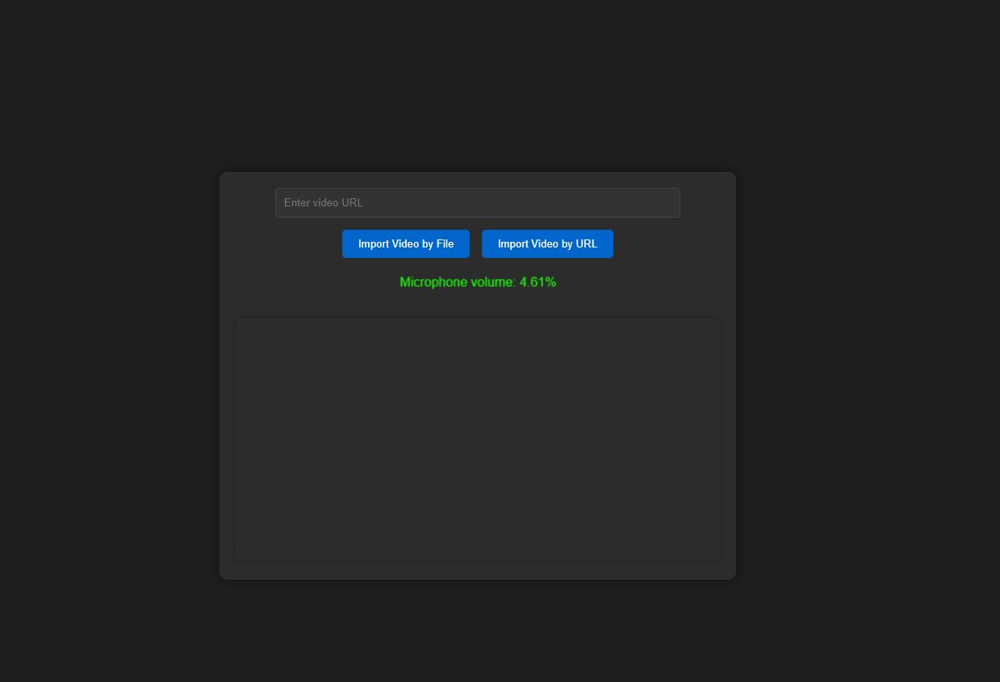
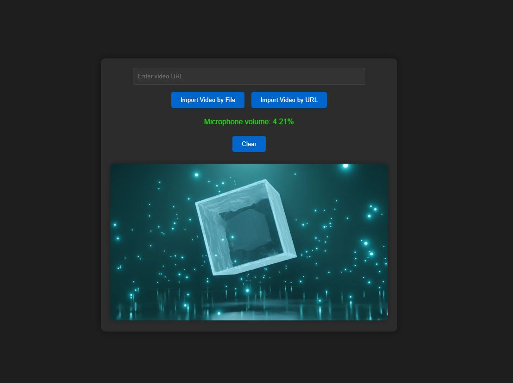
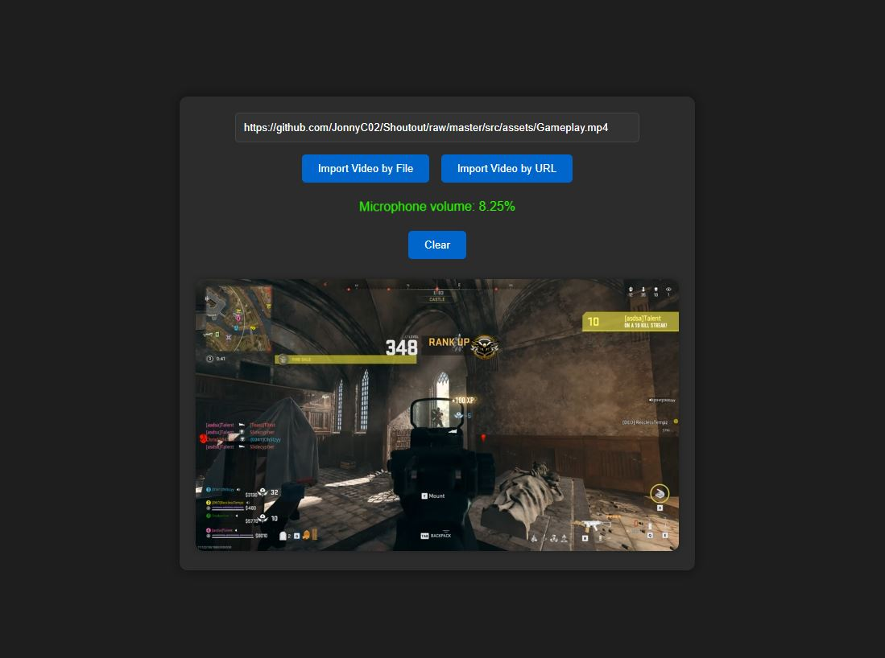

# Shoutout

Shoutout is an amazing media player developed for the CodingWithLewis Hackathon, 
held from August 9th to August 16th, 2024. The theme for this hackathon was **"Functionally Dysfunctional."**

## 🎯 Project Premise

Shoutout is designed to play media only when the user's microphone input is louder than the current video volume. 
To skip the video entirely, the user's voice must be at least 25% louder than the media's audio.

### Future Features
- Add a feature to allow users to adjust the sensitivity of the voice detection.
- Add a feature to allow users to adjust the volume of the media.
- Add a feature to allow for youtube video playback (currently only supports .mp4 files, no streamed content).
- Add a feature to allow for 'Open With' functionality to open media files with Shoutout.
- Add a feature to allow for the user to select the microphone to use for voice detection.
- Add a feature to allow users to resize the media player

### Project Screenshots







### Bugs
- Currently the media player playback jitters slightly when the microphone is not muted/completely silent, even if less than the video volume. (This is also a feature because its disfunctional)

## 🚀 Getting Started

### 🛠️ How to Compile

#### Windows
To compile the project on Windows, run:
```bash
yarn compile:win
```

#### macOS
To compile the project on macOS, run:
```bash
yarn compile:mac
```

The compiled executable will be placed in the `./build` folder at the project root.

### 🧪 Development Mode

If you're actively developing and want to test changes without building the final executable, use:
```bash
yarn dev
```

This command will build and open the current version of your code.

### 🧪 Testing
For easier testing purposes there are some assets located in `./src/assets/videos` that can be used to test the media player.

- URL Version: `https://github.com/JonnyC02/Shoutout/raw/master/src/assets/videos/Gameplay.mp4`
- Local Version: `./src/assets/videos/Gameplay.mp4`


## 👥 Contributors

- **Chris H** [@TalentedB](https://github.com/TalentedB)
- **Jonny C** [@JonnyC02](https://github.com/JonnyC02)
